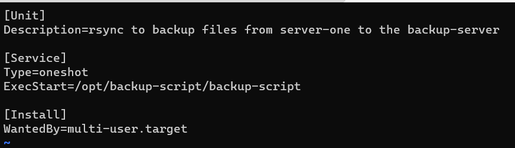

# 2420_week11_Lab: Backup Service and Weather Service
By Brandon Woo and Frank Zhu
<br>
<br>Two Linux services are included in this repository. The first being a backup service. The backup service uses the `rsync` command and uses ssh to backup files to the backup server. The service is configured to run every Friday at 1:00am (based on system timezone). The second service is one that tells the user the weather upon logging in to Linux Server. The service gets the weather everyday at 5:00am (based on system timezone).


## Prerequisites
- 2 Ubuntu Servers made in DigitalOcean
  - Root privilges on both servers

## Installation

### Cloning the Repository
1. Using a Linux Machine, clone this repository using `git clone https://github.com/bwoo14/2420_week11_Lab.git`
### Uploading to your server
1. Inside of this repository, run command 
```
sftp -i "<path to ssh key>" <user>@<ip address>
```
<br>Where: 
 - `<path to ssh key>` is the path to the ssh key that logs into your DigitalOcean server`
 - `<user>` is the user on your DigitalOcean server
 - `<ip address>` is the IP address of your DigitalOcean server
2. 


## Tutorial to Create the Backup Script

### Testing if your backup server is accessible with `rsync`
- Run the command `rsync -aPv -e "ssh -i <path to ssh key>" <file(s)> <user>@<ip-address>:<destination>`
  <br>`<path to ssh key>` = the location of the ssh key to your backup server
  <br>`<file(s)>` = the name of the file(s) you want to backup, for testing purposes, use a single directory with a single file in it
  <br>`<user>` = the user on the backup server you wish to ssh into
  <br>`<ip-address>` = the ip-address of the backup server
  <br>`<destination>` = the location on the backup server you want to save the backup file to
  
  >Running this command checks to see if the backup server is accessible using rsync. If the command was succesful, the output should look like this
- Run the command `vim backup-script` in your home directory
- Write shebang at the top then paste in rsync command that you previously ran. It should look like this:

- Save and exit out of file. Then, run `chmod u+x backup-script`.
- Delete the newly copied directory from your backup server. This is so you can test to see if your script works
- Run your backup script with `./backup-script`. If the script was successful, you should see the test backup directory in your backup server.

### Making the backup-script
- Make a configuration file in the `/etc` directory by running `sudo touch backup_script.conf`. It will contain information

>This configuration file will contain the variables required for the backup script. Each variable must be set to contain the information for your backup server and folders to backup. For example, the SSH variable must contain the path to your private key on your Linux machine. The `TARGET` variable can contain multiple paths to directories, but will have to be separated by spaces inside of quotes when assigning to the variable
- Edit the `backup-script` to source the new `backup_script.conf` file and replace the hardcoded inputs to the `rsync` commands with the variables that were sourced.
- The new script should look like this.


### Writing the Service File
- Run the command `vim backup-script.service`
- Edit the file so it has the following content:

  - The Description should contain a short description of what the script will do
  - The `ExecStart` indicates the script will run on startup

### Writing the Timer File
- Run the command `vim backup-script.timer`
- Edit the file so it has the following content:

>`RandomizedDelaySec=5m` the `5m` value can be changed to what the user requires. This value will allow the script to randomize the start time of each server that requires the backup from 0 seconds to the value required by the user. `RandomizedDelaySec` will change the value given into seconds.
- Save and exit the file
- Use the command `sudo timedatectl set-timezone America/Vancouver`
- Can change `America/Vancouver` to the desired timezone

### Moving the scripts and unit files to their correct directory
- Before starting, make a new directory in the /opt directory to hold the script 
- The new directory must match the directory specified in the `ExecStart` directive
- Run the command `sudo mkdir /opt/<directory name>` where `<directory name>` is the name of the directory you want to specify
- For us, the command was `sudo mkdir /opt/backup-script`
- 
- Run the command `sudo cp backup-script /opt/backup-script` to move the script file into the newly created directory
- Run the command `sudo cp backup-script.* /etc/systemd/system/` to move both service files to the `/etc/systemd/system/` directory

### Enabling the Backup Service
- Reload the daemon by using the command `sudo systemctl daemon-reload`
- Start the service using the command `sudo systemctl start backup-script.service`
- enable both the service file and the timer file using `sudo systemctl enable --now backup-script` and `sudo systemctl enable --now backup-script.timer`
- The service is now active, you can check that the timer is active using `sudo systemctl list-timers`
- As you can see from the screenshot the service is now scheduled to run (bottom line)


